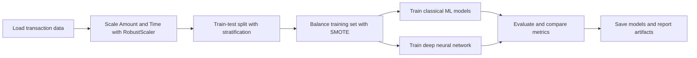

# Credit Card Fraud Detection

A polished machine learning project for detecting fraudulent credit card transactions with class imbalance handling, model comparison, reusable training code, and deployment-ready artifact saving.

## Project Highlights
- End-to-end fraud detection workflow based on your notebook analysis
- Handles severe class imbalance with `SMOTE`
- Compares `Logistic Regression`, `Random Forest`, `XGBoost`, and a `Deep Neural Network`
- Saves trained models, metrics, and feature importance artifacts
- Includes reusable Python modules instead of keeping all logic trapped in a notebook

## Problem Statement
Credit card fraud datasets are highly imbalanced, which makes plain accuracy misleading. This project focuses on metrics that matter more in fraud detection:
- `Precision`
- `Recall`
- `F1-score`
- `AUC-ROC`

## Workflow


## Models Included
- Logistic Regression
- Random Forest
- XGBoost
- Deep Neural Network

## Repository Layout
```text
Credit-Card-Fraud-Detection/
|-- src/fraud_detection/
|   |-- __init__.py
|   |-- data.py
|   |-- modeling.py
|   |-- train.py
|   `-- predict.py
|-- tests/
|   |-- test_data.py
|   `-- test_modeling.py
|-- requirements.txt
|-- .gitignore
`-- README.md
```

## Quickstart
1. Install dependencies:
   ```sh
   python -m pip install -r requirements.txt
   ```
2. Train the pipeline with the default dataset source:
   ```sh
   python -m src.fraud_detection.train
   ```
3. Train with a local dataset CSV:
   ```sh
   python -m src.fraud_detection.train --data-path path/to/creditcard.csv
   ```

## Dataset
The notebook uses the public credit card fraud dataset structure with these expected columns:
- `Time`
- `Amount`
- `V1` through `V28`
- `Class`

By default, the training script can pull the dataset from the public URL used in your notebook. You can also point it to a local CSV file.

## Key Ideas From The Notebook
- `RobustScaler` is used for `Amount` and `Time`
- `SMOTE` is applied only on the training split
- Results are ranked by `F1-score`
- Random Forest feature importance is exported for interpretability
- Trained models and summary CSV files are saved for reuse


