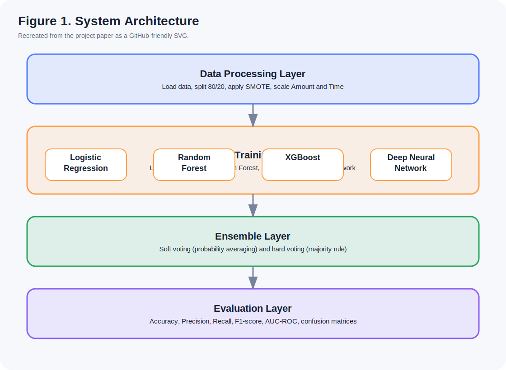
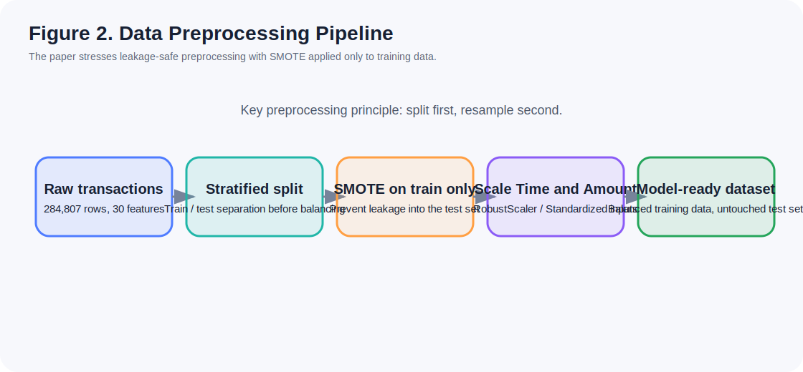
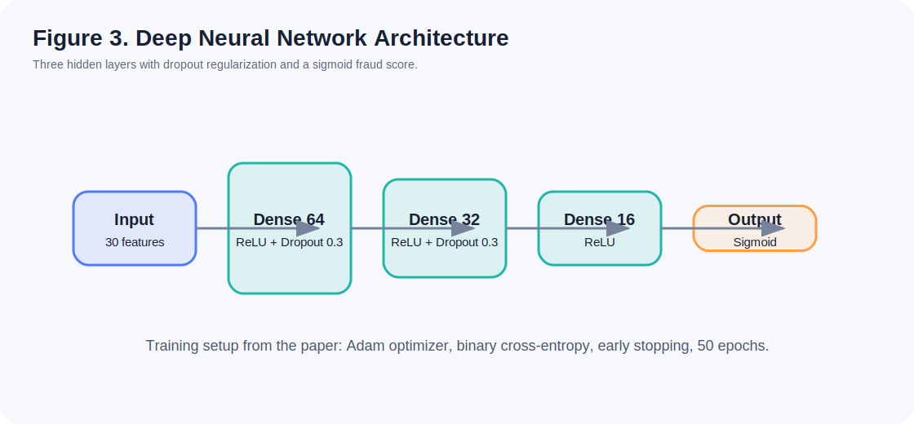
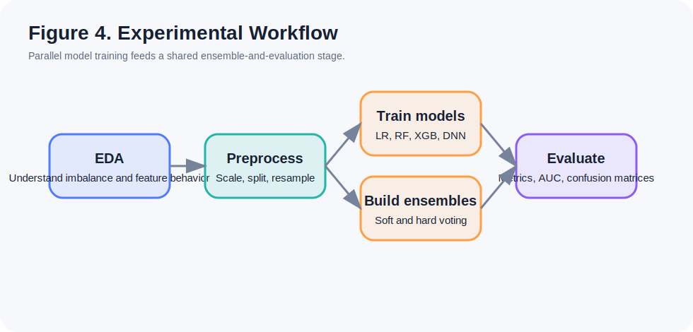
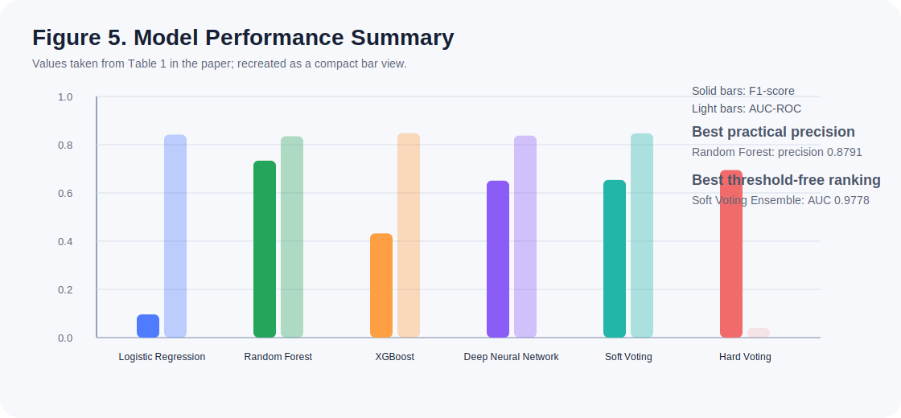
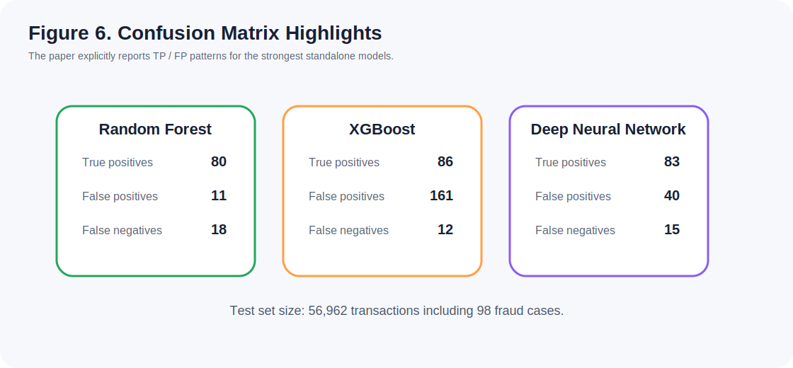
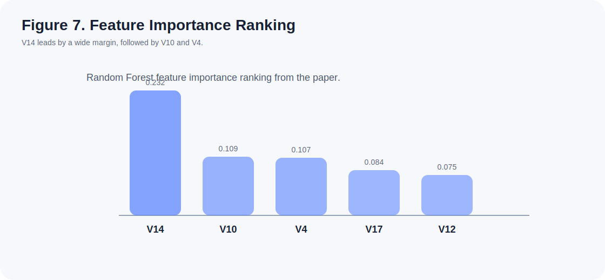
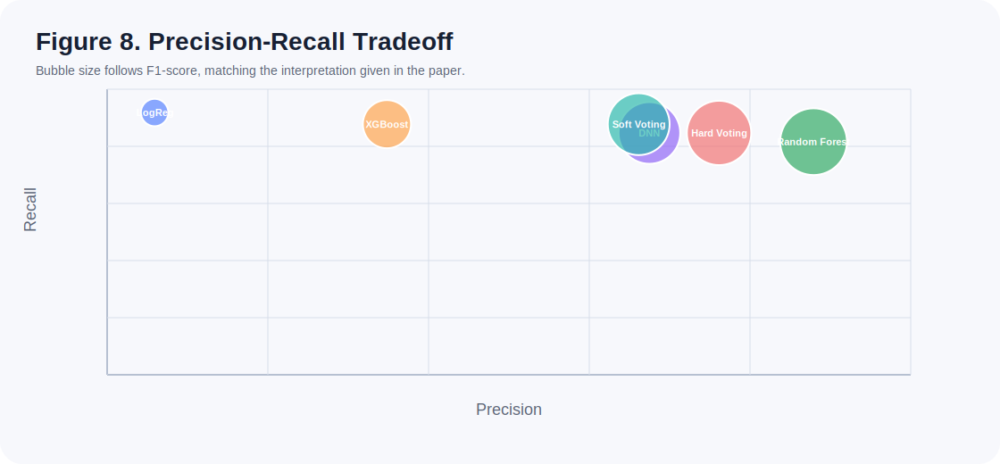
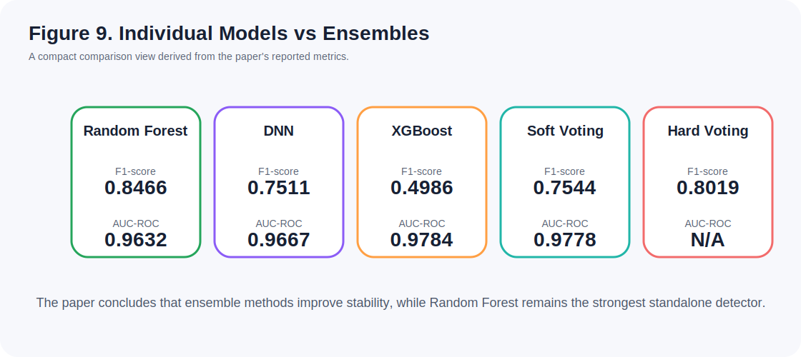

# Credit Card Fraud Detection

Credit card fraud detection project built around an imbalanced transaction dataset, a reproducible Python training pipeline, an updated notebook, and a cleaned research-style presentation of the system design and model results.

## What This Repo Now Includes

- Reusable Python package under `src/fraud_detection/`
- Updated project notebook in `notebooks/Credit_Card_Fraud_Detection.ipynb`
- Recreated paper figures as lightweight SVG assets for GitHub
- Side-by-side comparison of Logistic Regression, Random Forest, XGBoost, DNN, and ensemble variants
- Test coverage for the data and modeling modules

## Project Snapshot

| Area | Summary |
| --- | --- |
| Dataset | 284,807 anonymized European card transactions |
| Fraud cases | 492 transactions (0.172%) |
| Core challenge | Extreme class imbalance |
| Models | Logistic Regression, Random Forest, XGBoost, Deep Neural Network |
| Ensemble methods | Soft Voting, Hard Voting |
| Main metrics | Precision, Recall, F1-score, AUC-ROC |

## Why This Project Matters

Fraud detection is not a plain accuracy problem. In highly imbalanced settings, a model can score extremely high accuracy while still missing real fraud or flooding analysts with false positives. This repository focuses on the tradeoff that actually matters in practice:

- high recall to catch fraud
- high precision to reduce false alarms
- strong AUC-ROC for threshold-independent ranking

## Repository Layout

```text
Credit-Card-Fraud-Detection/
|-- src/fraud_detection/
|   |-- __init__.py
|   |-- data.py
|   |-- modeling.py
|   |-- train.py
|   `-- predict.py
|-- tests/
|   |-- test_data.py
|   `-- test_modeling.py
|-- notebooks/
|   |-- Credit_Card_Fraud_Detection.ipynb
|   `-- README.md
|-- assets/paper-figures/
|   |-- figure-01-system-architecture.svg
|   |-- figure-02-preprocessing-pipeline.svg
|   |-- figure-03-dnn-architecture.svg
|   |-- figure-04-experimental-workflow.svg
|   |-- figure-05-model-performance.svg
|   |-- figure-06-confusion-summary.svg
|   |-- figure-07-feature-importance.svg
|   |-- figure-08-precision-recall-tradeoff.svg
|   `-- figure-09-ensemble-comparison.svg
|-- requirements.txt
`-- README.md
```

## Quickstart

1. Install dependencies

```bash
python -m pip install -r requirements.txt
```

2. Train using the default dataset source

```bash
python -m src.fraud_detection.train
```

3. Train using a local dataset file

```bash
python -m src.fraud_detection.train --data-path path/to/creditcard.csv
```

## Method Overview

The pipeline follows a leakage-safe workflow:

1. Load the credit card dataset
2. Split train and test sets with stratification
3. Apply SMOTE only to the training split
4. Scale `Time` and `Amount`
5. Train four base models
6. Compare standalone and ensemble performance
7. Export trained artifacts and summaries

## Recreated Paper Figures

The following figures were recreated from the accompanying project paper as SVG assets so they render clearly on GitHub and remain easy to version.

### Architecture And Workflow

<p>
  
</p>

<p>
  
</p>

<p>
  
</p>

<p>
  
</p>

### Results And Interpretation

<p>
  
</p>

<p>
  
</p>

<p>
  
</p>

<p>
  
</p>

<p>
  
</p>

## Reported Test-Set Results

Test set size: `56,962` transactions including `98` fraud cases.

| Model | Accuracy | Precision | Recall | F1 | AUC-ROC |
| --- | ---: | ---: | ---: | ---: | ---: |
| Logistic Regression | 0.9747 | 0.0591 | 0.9184 | 0.1110 | 0.9712 |
| Random Forest | 0.9995 | 0.8791 | 0.8163 | 0.8466 | 0.9632 |
| XGBoost | 0.9970 | 0.3482 | 0.8776 | 0.4986 | 0.9784 |
| Deep Neural Network | 0.9990 | 0.6748 | 0.8469 | 0.7511 | 0.9667 |
| Soft Voting Ensemble | 0.9990 | 0.6615 | 0.8776 | 0.7544 | 0.9778 |
| Hard Voting Ensemble | 0.9993 | 0.7615 | 0.8469 | 0.8019 | N/A |

## Key Takeaways

- Random Forest offers the strongest precision-focused standalone performance.
- Logistic Regression reaches the highest recall but generates too many false positives to use alone.
- The Deep Neural Network stays competitive and offers a good middle ground.
- Soft Voting achieves the best reported AUC-ROC.
- Hard Voting improves stability and produces strong practical performance.

## Notebook And Code

- Notebook workflow: `notebooks/Credit_Card_Fraud_Detection.ipynb`
- Training entry point: `src/fraud_detection/train.py`
- Prediction utilities: `src/fraud_detection/predict.py`
- Data loading and preprocessing helpers: `src/fraud_detection/data.py`
- Model assembly utilities: `src/fraud_detection/modeling.py`

## Citation

If you want to cite this repository, reference the GitHub project and, when relevant, the accompanying project paper titled:

`Credit Card Fraud Detection Using Advanced Machine Learning Techniques: A Comparative Study with Ensemble Methods and Deep Learning`

Suggested GitHub citation fields:

- Author: `Lazy-Master`
- Title: `Credit-Card-Fraud-Detection`
- Platform: GitHub
- URL: `https://github.com/Lazy-Master/Credit-Card-Fraud-Detection`

## Notes

- The figure assets in `assets/paper-figures/` are recreated from the project paper for web readability.
- The notebook in `notebooks/` is the latest updated version prepared for repository use.
